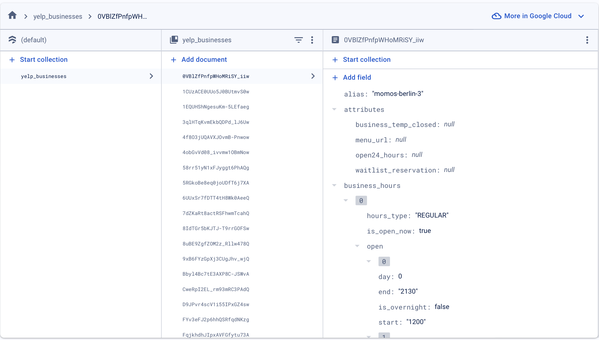

{: .label }
[Jane Dane]

{: .no_toc }
# Design decisions

{: .text-delta }

Table of contents

+ ToC
{: toc }

## 01: Firebase-Authentifizierung
### Meta

Status: Entschieden

### Problemstellung
Um sicherzustellen, dass unsere Webanwendung eine sichere und effiziente Benutzerverwaltung bietet, musste ein Authentifizierungssystem eingeführt werden. Dieses sollte sowohl die Registrierung neuer Benutzer als auch die Anmeldung bestehender Benutzer ermöglichen.

### Entscheidung
Wir beschlossen, die Firebase-Authentifizierung zu verwenden, weil sie eine Vielzahl von Authentifizierungsoptionen anbietet und gute Sicherheitsmerkmale aufweist. Firebase stellt außerdem eine anpassungsfähige und nützliche Lösung zur Verfügung, die wir wirksam in einem anderen Modul verwendet haben und somit den Entwicklungsprozess deutlich vereinfacht und beschleunigt haben, da wir bereits mit der Firebase-Authentifizierung vertraut waren.

## 02: Bootstrap 
### Meta
Status: Entschieden

### Problemstellung

Bei unserem Projekt standen wir vor der Herausforderung, ein konsistentes und ansprechendes Design zu codieren. Daher benötigten wir ein Design-Framework, das für Konsistenz sorgt und die Benutzeroberfläche effizient gestaltet, um den Entwicklungsprozess zu beschleunigen.

### Entscheidung
Diese Herausforderung bewältigten wir durch die Verwendung von Bootstrap, einem Framework, das uns in der Vorlesung vorgestellt wurde. Die vorgefertigten Komponenten haben uns dabei geholfen Zeit zu sparen und schneller voranzukommen.
Mit diesen Werkzeugen war es uns möglich Layouts schnell zu erstellen. Dadurch hat sich der Entwicklungszeitaufwand deutlich verringert.

### In Betracht gezogene Optionen
Es wäre uns möglich gewesen, nur mit HTML und CSS zu arbeiten. Dies hätte uns jedoch einen deutlich größeren Zeitaufwand für die Entwicklung und die Prüfung bedeutet. Im Gegensatz dazu stellt Bootstrap vordefinierte Layouts und Styles zur Verfügung.

## 03: Firestore for Database
### Meta

Status: Entschieden

### Problemstellung
Wir brauchten eine Datenbank zum Speichern unserer Restaurantdaten, da wir die Yelp-API aufgrund eines Limits von 300 API-Calls pro Tag nicht immer aufrufen konnten. 

### Entscheidung
Daher haben wir uns für die Firestore Datenbank entschieden, da ein Dozent in einem anderen Modul sie uns empfahl.

### In Betracht gezogene Optionen
Wir hätten uns auch für die im Kurs besprochene Datenbank (SQLAlchemy) entscheiden können, aber wir haben uns für Firestore entschieden. Da wir für unsere Webanwendung hauptsächlich nur die von einer API bereitgestellten Daten verarbeiten müssen und keine Nutzerdaten (außer für die Anmeldung) speichern, erschien Firestore einfacher.

## 04: Yelp Fusion API Integration

### Meta
Status: Entschieden

### Problemstellung

Für die Idee, die wir für unser Projekt besprochen haben, brauchten wir eine API. Das Problem war, dass wir die Restaurantdaten nicht manuell eingeben wollten und sie in Kategorien geteilt brauchten. Außerdem wollten wir, dass die Benutzer auch sehen können, wie das Restaurant von anderen bewertet wurde, damit die Bewertung ihnen bei der Entscheidung für das Restaurant helfen kann.

### Entscheidung
Wir haben uns für die Yelp Fusion API entschieden, da wir die Restaurants mit dieser API nach Kategorien filtern konnten (für unsere categories.html). Außerdem haben wir durch unsere Recherche auch herausgefunden, dass die API auch Rezensionen liefert.

