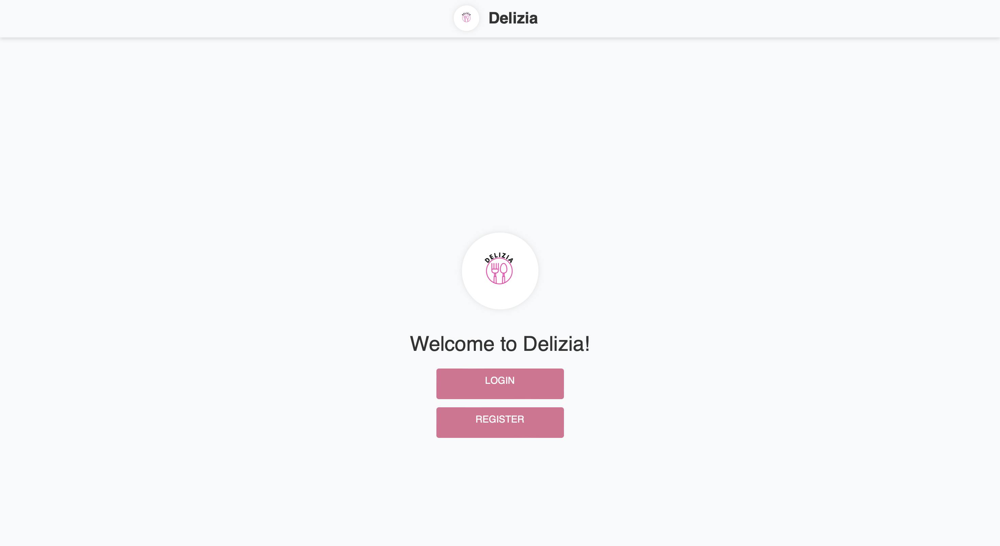
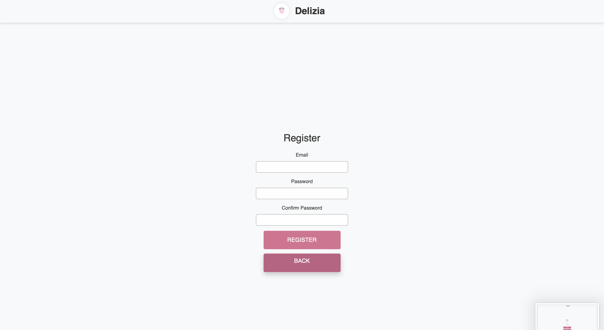
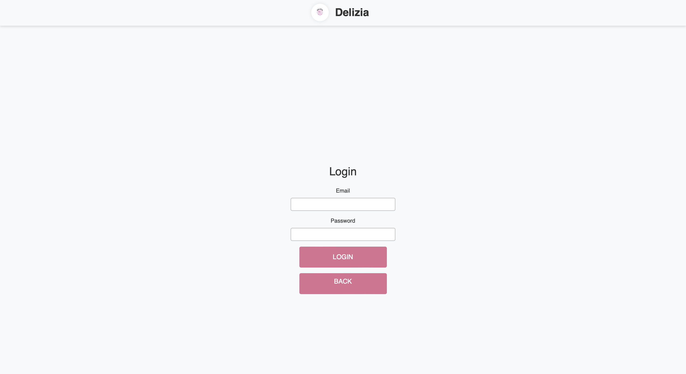
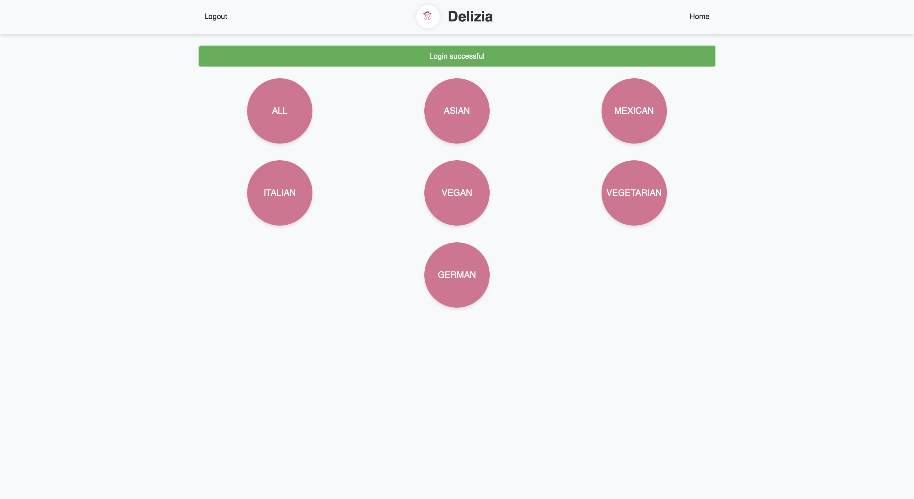
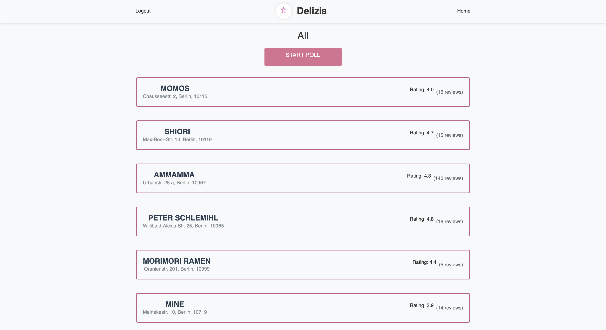
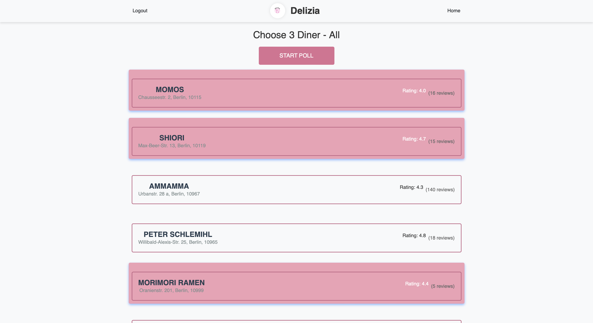
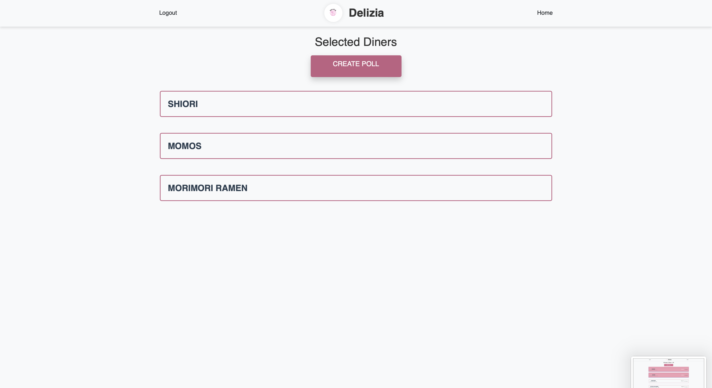
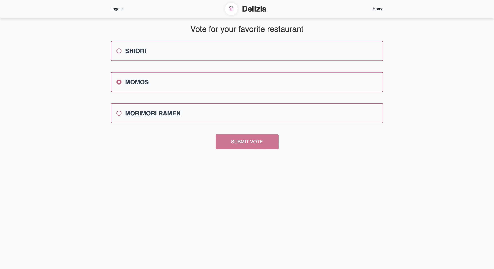
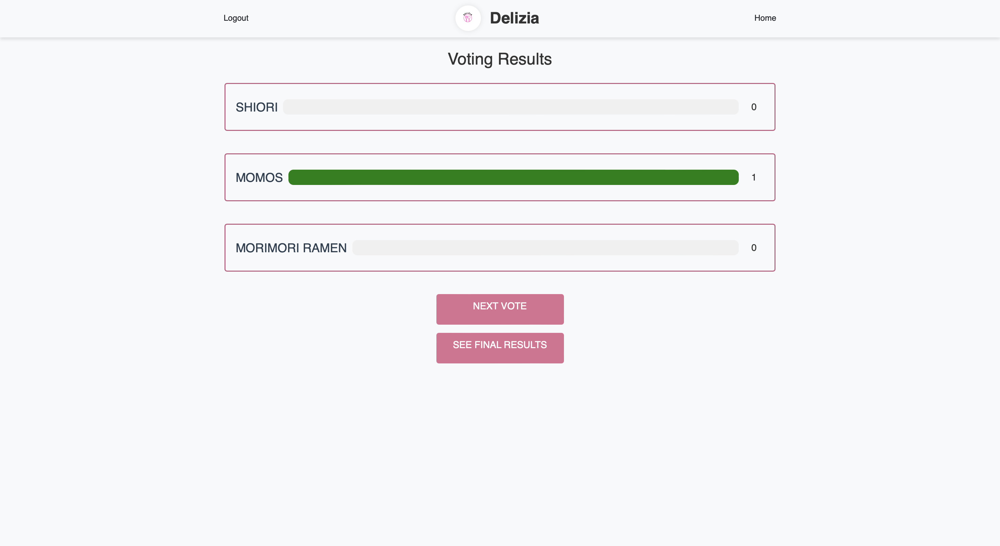
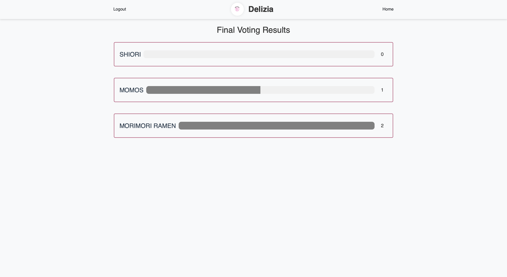

{: .label }
[Jane Dane]

{: .no_toc }
# Reference documentation

{: .text-delta }

Table of contents

+ ToC
{: toc }

## Homepage
Route: /

Methode: GET 

Zweck: Diese Route wird verwendet, um die Homepage der Webanwendung darzustellen. Wenn ein Benutzer die Stamm-URL (/) besucht, wird die Home-Funktion aufgerufen. Diese Funktion gibt einfach die Vorlage index.html zurück, die die Homepage der Delizia-Webanwendung ist.

Beispielausgabe:

## Register

*register()*

Route: /register

Methoden: GET, POST

Zweck:
Diese Route behandelt die Benutzerregistrierung. Wenn eine GET-Anfrage gestellt wird, wird das Registrierungsformular (register.html) gerendert. Wenn eine POST-Anfrage gestellt wird, verarbeitet sie die Daten, um einen neuen Benutzer zu registrieren. Wenn die Passwörter nicht übereinstimmen, wird eine Fehlermeldung angezeigt. Wenn die Registrierung erfolgreich ist, wird der Benutzer auf die Anmeldeseite umgeleitet, wenn nicht wird eine entsprechende Fehlermeldung angezeigt.

Beispielausgabe:

## Anmeldung

*login()*

Route: /login

Methoden: GET, POST

Zweck:
Diese Route behandelt die Benutzeranmeldung. Wenn eine GET-Anfrage gestellt wird, wird das Anmeldeformular (login.html) angezeigt. Wenn eine POST-Anfrage gestellt wird, werden die Daten des Anmeldeformulars verarbeitet, um den Benutzer zu authentifizieren. Wenn die Anmeldung erfolgreich ist, wird der Benutzer auf die Kategorienseite umgeleitet, andernfalls wird eine Fehlermeldung angezeigt.

Beispielausgabe:

## Abmeldung

*logout()*

Route: /logout

Methoden: GET

Zweck:
Diese Route meldet den Benutzer ab, indem sie die Benutzersitzung entfernt und ihn mit einer Erfolgsmeldung auf die Homepage weiterleitet.

## Kategorien anzeigen

*categories()*

Route: /categories

Methoden: GET

Zweck:
Diese Route zeigt die Kategorienseite an, auf der Benutzer eine Restaurantkategorie zur Ansicht auswählen können. Wenn der Benutzer nicht angemeldet ist, wird er mit einer Fehlermeldung auf die Anmeldeseite umgeleitet.

Beispielausgabe:

## alle Restaurants anzeigen

*all()*

Route: /category/all

Methoden: GET

Zweck:
Diese Route ruft alle Restaurants von Firestore ab und zeigt sie an. Wenn keine Restaurants gefunden werden, wird ein 404-Fehler mit einer Meldung zurückgegeben.

Beispielausgabe:

## Restaurants der bestimmten Kategorien anzeigen

Route: /category/XXX

XXX steht für die einzelnen Kategorien (asian, mexican, italian, vegan,vegetarian, german).

Methoden: GET

Zweck:
Diese Route ruft alle Restaurants der bestimmten Kategorie (xxx) von Firestore ab und zeigt sie an. Wenn keine Restaurants gefunden werden, wird ein 404-Fehler mit einer Meldung zurückgegeben.

## Restaurant auswählen

*choosediner()*

Route: /choosediner

Methoden: GET, POST

Zweck:
Diese Route ermöglicht es Benutzern, bis zu drei Restaurants aus einer ausgewählten Kategorie auszuwählen. Wenn eine GET-Anfrage gestellt wird, wird die Liste der Restaurants in der ausgewählten Kategorie angezeigt. Wenn eine POST-Anfrage gestellt wird, werden die ausgewählten Restaurants in der Sitzung gespeichert und auf die Seite zur Erstellung der Umfrage weitergeleitet.

Beispielausgabe:

Wählbare Restaurantliste

## Umfrage erstellen

*createpoll()*

Route: /createpoll

Methoden: GET

Zweck:
Diese Route zeigt die ausgewählten Gäste an und bietet die Möglichkeit, eine Umfrage zum Abstimmen zu erstellen.

Beispielausgabe:

Zeigt die ausgewählten Restaurants und eine Schaltfläche zum Erstellen der Umfrage

## Abstimmungsroute

*vote()*

Route: /vote

Methoden: GET

Zweck:
Diese Route zeigt die Restaurants an, die der Abstimmung zur Verfügung stehen.

Beispielausgabe:

Die Liste von Restaurant mit Optionsfeldern zum Abstimmen

## Senden der Stimme

*submit_vote()*

Route: /submit_vote

Methoden: POST

Zweck:
Diese Route behandelt die Übermittlung der Stimme eines Benutzers. Sie aktualisiert die Sitzung mit dem ausgewählten Restaurant und leitet zur Seite mit den Abstimmungsergebnissen weiter.

Ausgabe:
Weiterleitung zur Seite mit den Abstimmungsergebnissen

## Route für Abstimmungsergebnisse

*vote_results()*

Route: /vote_results

Methoden: GET

Zweck:
Diese Route zeigt die Ergebnisse der Abstimmung an und zeigt die Anzahl der Stimmen, die jedes Restaurant erhalten hat.

Beispielausgabe:

Anzeige der Abstimmungsergebnisse mit Fortschrittsbalken, die die Stimmenanzahl angeben

## endgültige Ergebnisse

*final_results()*

Route: /final_results

Methoden: GET

Zweck:
Diese Route zeigt die endgültigen Abstimmungsergebnisse an und zeigt die Gesamtzahl der Stimmen, die jedes Restaurant erhalten hat.

Beispielausgabe:

