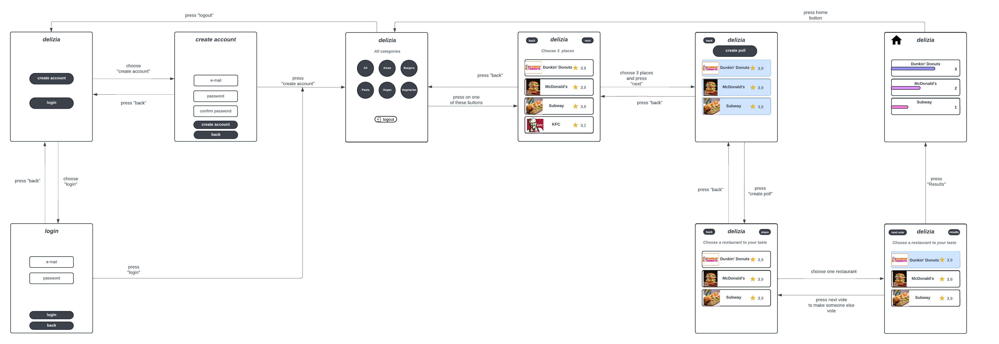

{: .label }

{: .no_toc }
# Value proposition

{: .text-delta }

Table of contents

+ ToC
{: toc }

## The problem

Wir haben festgestellt, dass wenn man mit einer Gruppe einen gemeinsamen Restaurantbesuch plant, die Auswahl des Lokals sich manchmal in die Länge zieht. Grund dafür ist, dass zum Beispiel berücksichtigt werden muss, dass nicht alle Fleisch essen. Außerdem ist es natürlich auch wichtig, dass alle mit der Auswahl zufrieden sind und für jeden Geschmack etwas dabei ist.  Ein weiteres Problem, das besonders in großen Gruppen auftritt, ist die oft endlose Diskussion über die Restaurantwahl. Die Vielzahl an Meinungen führt häufig zu einem Hin und Her, was die Entscheidungsfindung erheblich verzögert. Solche Diskussionen können manchmal länger dauern, was die Planung zusätzlich erschwert.

## Our solution

Durch unsere Web-Anwendung, Delizia, wollen wir dieses Problem lösen. Den Auswahlprozess wollen wir minimieren, indem man zuerst Restaurants in Berlin angezeigt bekommt. Anschließend kann man über Kategorien filtern, was genau man essen möchte (All, Asian, Vegan, Vegetarian…). Sobald dies getan ist, können Nutzer einige Restaurants markieren und dann eine Abstimmung erstellen. Um sicherzustellen, dass alle bzw. die meisten in der Gruppe mit dem Essen zufrieden sind, bietet Delizia die Möglichkeit, die Abstimmung auf der Webseite ein weiteres Mal für andere Personen zu starten. So kann ausgewertet werden, welches Restaurant vom Großteil der Gruppe bevorzugt wird. Dadurch wird der Entscheidungsprozess effizienter gestaltet und die Zufriedenheit aller Teilnehmer gewährleistet.

## Target user

### Gruppenpersona: Freundeskreis "Die Genießer"

Ein Freundeskreis von 6-8 Personen im Alter von 25-35 Jahren, der regelmäßig zusammen ausgeht, um neue Restaurants und kulinarische Erlebnisse zu entdecken.

Die Gruppe hat unterschiedliche Ernährungspräferenzen z.B. zwei Vegetarier, ein Veganer und schätzt vielfältige und internationale Küchen wert. Außerdem ist sie technisch versiert und nutzt oft Online-Bewertungen zur Restaurantwahl.

**Bedürfnisse**

Sie möchten ein Restaurant finden, das für alle Ernährungsbedürfnisse geeignet ist.
Zudem möchten Sie die Möglichkeit haben schnell und effizient eine Einigung zu erzielen, ohne lange Diskussionen und Planungen. Wichtig ist ihnen auch sicherzustellen, dass Bewertungen einsehbar sind, um die Wahl zu beschleunigen

**Ziele**
- Zeit sparen bei der Planung und Organisation von Restaurantbesuchen
- Sicherstellen, dass jeder im Freundeskreis zufrieden ist und das kulinarische Erlebnis genießt.
- Neue und interessante Restaurants entdecken, die zu den vielfältigen Vorlieben passen.

**Lösungsansatz**

Unsere Lösung hilft dem Freundeskreis "Die Genießer", effizient ein Restaurant zu finden, das die Bedürfnisse und Vorlieben aller Mitglieder erfüllt. Sie bietet eine schnelle Entscheidungsfindung und sorgt dafür, dass der gemeinsame Abend ein Erfolg wird, ohne langwierige Diskussionen und Planungen.

## Customer journey

